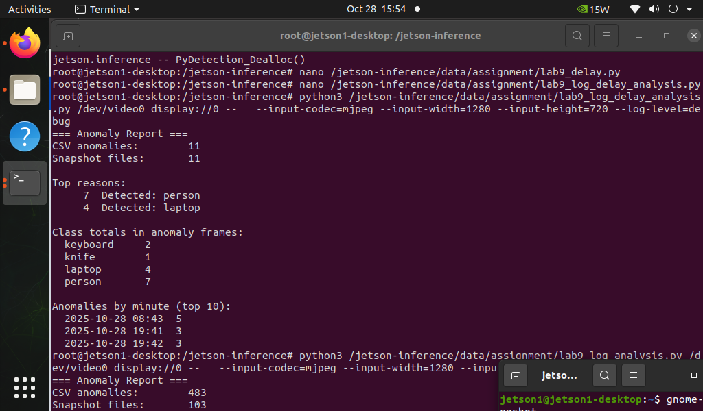

# Real-Time Anomaly Detection (Jetson + DetectNet) — Rule-Based

> This project extends **NVIDIA Jetson-Inference DetectNet** to perform **real-time anomaly detection** using a USB camera.  
> Current anomaly rule: flag whenever **People** or **Laptop** are detected.  
> The system runs inside the **Jetson-Inference Docker container** and includes a **delay/cooldown** mechanism to prevent duplicate logs.


---

## About the Project
- **Normal behavior:** No people or laptops in frame.  
- **Anomaly:** If the model detects `person` or `laptop`, a red banner appears on screen, the event is logged in CSV, and an annotated frame is optionally saved.  
- Built for flexible rule editing — you can modify the anomaly list in the script (e.g., add `"cell phone"`, `"bottle"`, etc.).  

---

## Built With
- NVIDIA **Jetson** (Ubuntu) + USB Camera  
- [`jetson-inference`](https://github.com/dusty-nv/jetson-inference)  
- TensorRT-optimized **DetectNet** models (COCO)  
- Python 3  

---

## Getting Started

### Step 1 — Run the Jetson-Inference Docker Container
Before running anomaly detection, start the official container (pre-bundled with all dependencies):

refer - https://github.com/dusty-nv/jetson-inference/tree/master

Once inside the container:

---

### Step 2 — Clone and Set Up Your Repo
```bash
git clone https://github.com/Anjali9815/Jetson-Real-Time-Anomaly-Detection.git
cd Jetson-Real-Time-Anomaly-Detection
mkdir -p src data images
# Place your code:
# /mnt/data/lab9_assignment_delay.py → src/lab9_assignment_delay.py
```

---

### Step 3 — Run the Anomaly Detection log Analysis 
```bash
python3 src/lab9_assignment_delay.py   --log data/anomaly_log.csv
```

---

## Command-Line Options

| Argument | Description |
|-----------|--------------|
| `--base` | Base directory containing `anomaly_log_delaytime.csv`, `detections.log`, `anomaly_images/` |
| `--csv` | Path to custom CSV output file |
| `--log` | Log file for detection summary |
| `--snapshots` | Directory to save anomaly snapshots |
| `--sample` *(int)* | If >0, write `sample_review_list.txt` with N random snapshot filenames for manual review |

---

## Output Artifacts
- **data/anomaly_log.csv** — timestamped anomaly logs  
- **images/** — annotated frames where anomalies occurred  
- **result.txt** — optional summary of terminal output  
- **images/lab9_1.png** — screenshot for documentation  

Example log entry:
```
2025-10-28 02:05:12,rule_trigger,ANOMALY: detected person,laptop
```

---

## Editing the Anomaly List
Inside `lab9_assignment_delay.py`, locate the section that defines forbidden classes:
```python
FORBIDDEN = ["person", "laptop"]
```
Modify this list to change what counts as an anomaly.  
Examples:
```python
FORBIDDEN = ["cell phone", "bottle"]
```
---

## Contributing
PRs welcome:
1. Fork  
2. Create branch: `feature/...`  
3. Commit and push  
4. Open PR  

---

## License
Unlicense (Public Domain). See `LICENSE`.

---

## Contact
**Anjali Jha** — [LinkedIn](https://www.linkedin.com/in/anjali-jha-069aa6184/)  
📁 Project: [Jetson-Real-Time-Anomaly-Detection](https://github.com/Anjali9815/Jetson-Real-Time-Anomaly-Detection)

---

## Acknowledgments
- [NVIDIA Jetson-Inference Repository](https://github.com/dusty-nv/jetson-inference)  
- DetectNet and COCO dataset contributors  
- Best-README-Template for structure inspiration  
